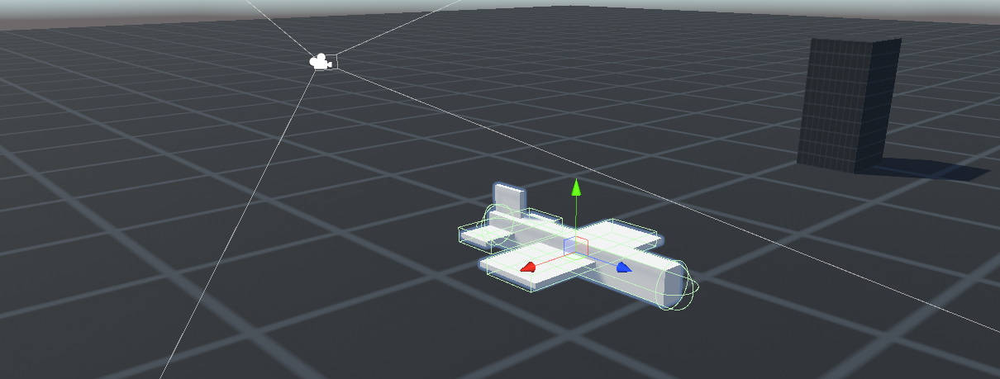
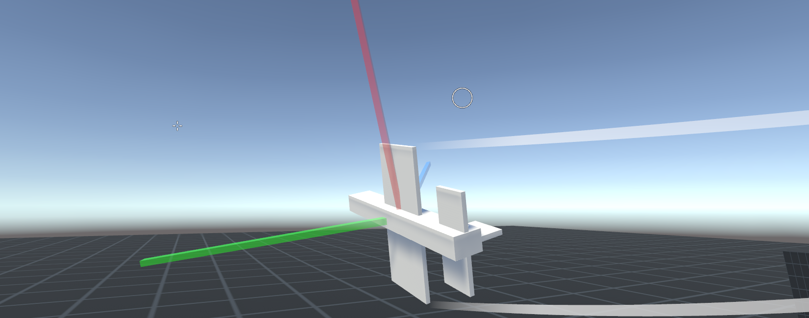

# Mouse Flight
This project is an example of mouse controls for aircraft based on the excellent system used by Gaijin's War Thunder. It is in my opinion the single best and most robust system for controlling aircraft, especially those with more realistic physics.

This project was built in **Unity 2017.3.1f1**, and tested in 2018.3.0 and 5.6.4.

## Download
You can either clone the repository or [download the asset package](https://github.com/brihernandez/MouseFlight/raw/master/MouseFlight.unitypackage) located in the root.

## Demo Controls

To fly the demo plane, simply move the mouse around. The circle is controlled by the mouse, while the crosshair shows where the plane is pointed. The plane will automatically try to fly towards the crosshair.

Sometimes you might want to manually control the pitch or roll for a maneuver, so a couple keyboard overrides exist.

- W/S: pitch up/down
- A/D: roll left/right

# Usage
The core of this project is the `MouseFlightController` component and the `MouseFlightRig` prefab.

1. Drop the `MouseFlightRig` prefab into your scene
2. Assign your vehicle's transform to the `Aircraft` property in the `MouseFlightController`'s Inspector
3. In code, use the `MouseFlightController.MouseAimPos` C# property to get the world postion the mouse cursor is pointing to
4. Make your vehicle fly to that position
5. Use the `MouseFlightController.MouseAimPos` and `MouseFlightController.BoresightPos` C# properties to draw HUD elements for the mouse cursor and aircraft's direction respectively

The camera rig only handles telling where the aircraft is meant to fly. **How** your aircraft actually flies towards that point is an implementation detail specific to your project and will require scripting. The same goes for the HUD elements.

To give an example of how you might do this, the demo includes a very simple Rigidbody based airplane with the steering behaviors necessary to fly itself. An extremely simple HUD is also included to demonstrate how it's supposed to work.

# Control Principles
The mouse is not an ideal method of controlling an aircraft. Most control schemes involve using the mouse as a substitute for a joystick or otherwise directly controlling the aircraft. While these can work, they don't take advantage of the mouse's greatest strength: as a pointing device.

What the control scheme in this project does is allow the player to use the mouse as a pointing device to fly the plane. If you want to fly towards something, you simply put the mouse cursor over it and the plane will fly towards it. If you want to aim at something, just put the mouse cursor over it.

# Mouse Control Rig

The simplest way to accomplish this idea is to have an orbit camera that gets rotated by the mouse, crosshair in the middle of the screen, and then wherever the camera is pointed is where the plane flies. While this definitely does work, it can be a bit clumsy and make for some jarring camera movement depending on your game. Examples of this style of control would be the Halo games or World of Warplanes.

To get around this and emphasize the mouse's pointing ability, the camera and mouse control need to be separated. As can be seen in the expanded hierarchy of the rig prefab, one transform is rotated directly by the mouse and used to point towards a direction, while the camera transform smoothly looks in this direction using its own, separate rig. This separation allows for accurate pointing with the mouse while maintaining smooth camera motion. This is the method used by War Thunder.

## Rig Transforms

### Aircraft
The reference transform used for both the boresight position and for the rig to follow. You'll want to check the `Use Fixed` option depending on if the aircraft is moved in Update or FixedUpdate loops. Having this set wrong will result in jittery looking movement.

### Mouse Aim
The heart of rig. This is an empty transform that is rotated directly by the mouse in order to generate the `MouseAimPos`. The `MouseAimPos` is the forward of this transform multiplied by the `Aim Distance` given in the inspector.

In order to keep the rotations intuitive, the rotations **must happen relative to the camera**. This way, when the user moves the mouse left, the apparent position of the `MouseAimPos` (and consequently your cursor) should also move left on the screen regardless of the current orientation.

### Camera Rig
Used to rotate a camera to face the aim position. This is the typical orbit camera setup where a camera is put on a parent transform centered on the player, and then that transform is rotated. Normally, this rig is kept level with horizon (up vector is world's up). However, when the aircraft is flying straight up or down, this will cause problems. In those situations, the camera rig's `Quaternion.LookRotation`s are generated using the rig's own up vector rather than the world's up.

If you'd like to add camera motion, such as the camera moving back when the aircraft accelerates, this is the Transform to modify.

### Camera
Transform of the camera itself. Only used as reference for rotating the MouseAim transform relative to the screen.

# Changelog

### 1.1 (Jan 6 2019)

- Converted project/package to 2017.3.1f1 for improved compatibility
- Removed C# code that was dependent on .Net 4.6 for improved compatibility

### 1.0 (Jan 4 2019)

- Released
